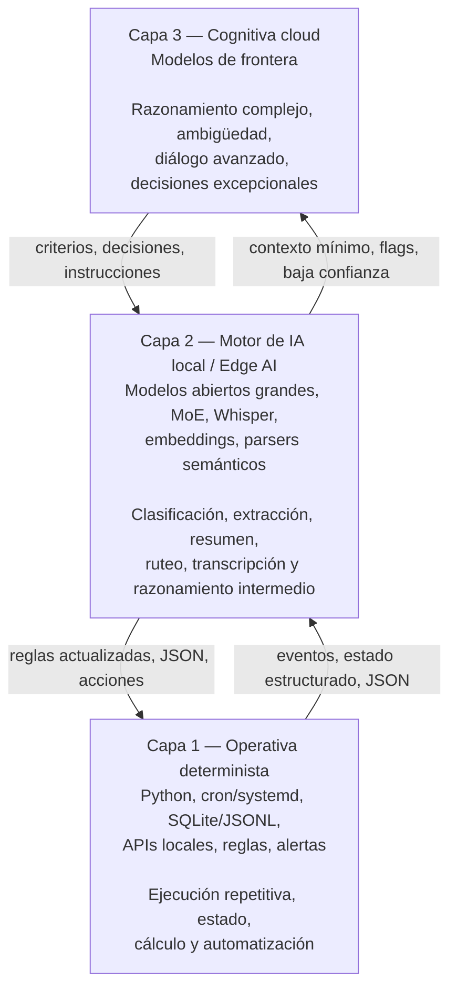

# Arquitectura tri-capa para agentes autónomos

## Separar ejecución determinista, IA local e IA cloud para reducir tokens, latencia y exposición de datos

> Este documento resume una arquitectura práctica para construir agentes autónomos en producción. No es un paper académico ni un benchmark universal. Está basado en experiencia real desarrollando agentes locales sobre OpenClaw, con foco en soberanía de datos, eficiencia operativa y uso responsable de modelos de lenguaje.

---

## Resumen

Muchos sistemas de agentes basados en LLMs terminan usando modelos de frontera en la nube para casi todo: leer datos crudos, repetir cálculos, revisar estados, interpretar eventos simples, formatear alertas y responder al usuario.

Ese enfoque funciona bien para prototipos, pero en producción aparece un problema estructural: el costo, la latencia y la exposición de datos crecen con la frecuencia de ejecución del agente, no con la dificultad real de la tarea.

Este documento propone una arquitectura tri-capa:

1. **Capa 1 — Operativa determinista:** código local para tareas repetitivas, numéricas, transaccionales y de alta frecuencia.
2. **Capa 2 — Motor de IA local / Edge AI:** modelos abiertos ejecutados localmente para clasificación, extracción, resumen, ruteo semántico y razonamiento intermedio.
3. **Capa 3 — Cognitiva cloud:** modelos de frontera externos para razonamiento complejo, ambigüedad, diálogo avanzado y decisiones que realmente justifican el costo.

La idea central es simple:

> **No todo lo que parece inteligente necesita pasar por un LLM de frontera.**

En los agentes descritos acá, la mayor parte del trabajo continuo se resuelve localmente. La nube queda reservada para casos donde agrega valor real.

---

## 1. El problema: el agente FOMO

Llamo **agente FOMO** al patrón donde un agente manda todo al LLM “por las dudas”.

Por ejemplo:

* logs completos;
* correos enteros;
* estados de cuenta;
* datos de mercado minuto a minuto;
* historiales repetidos;
* reglas que podrían estar codificadas;
* decisiones binarias simples;
* alertas que podrían formatearse con templates;
* contexto sensible que no siempre necesita salir del entorno local.

El resultado es un agente que parece sofisticado, pero que en producción tiene tres problemas claros.

### 1.1 Costo variable innecesario

Si cada evaluación rutinaria consume tokens, el costo mensual queda atado a la frecuencia de monitoreo.

Un scanner que corre cada minuto no debería pagarle a un modelo de frontera para descubrir que “no pasó nada”.

### 1.2 Latencia acumulada

Muchas tareas operativas requieren respuesta rápida: deduplicar, validar umbrales, consultar una API, guardar estado, enviar una alerta.

Para eso, una llamada completa a una API externa suele ser excesiva.

### 1.3 Exposición de datos

Enviar datos crudos a terceros puede ser aceptable en algunos escenarios, pero no debería ser la opción por defecto.

Datos financieros, correos, documentos internos, logs, credenciales, sesiones, historiales o conversaciones privadas deberían pasar por un criterio de minimización antes de salir del entorno local.

---

## 2. Principio de diseño

La arquitectura se basa en una regla práctica:

> **Usar el nivel mínimo de inteligencia suficiente para resolver bien la tarea.**

No se trata de evitar la IA cloud. Se trata de usarla donde corresponde.

| Tipo de tarea                                                                                  | Mejor capa | Motivo                                         |
| ---------------------------------------------------------------------------------------------- | ---------: | ---------------------------------------------- |
| Cálculos, umbrales, deduplicación, consultas programadas, templates, alertas simples           |     Capa 1 | Determinista, barato, auditable                |
| Clasificación de intención, extracción de entidades, resumen local, parsing semántico, ruteo   |     Capa 2 | Requiere lenguaje, pero no necesariamente nube |
| Ambigüedad, negociación, razonamiento complejo, explicación estratégica, rediseño de criterios |     Capa 3 | Requiere mayor capacidad cognitiva             |

La pregunta clave no es:

> “¿Puede hacerlo un LLM?”

La pregunta correcta es:

> “¿Necesita hacerlo un LLM de frontera externo?”

Muchas veces la respuesta es no.

---

## 3. Visión general de la arquitectura



Cada capa tiene una responsabilidad distinta.

La Capa 1 ejecuta.
La Capa 2 entiende, filtra y enruta.
La Capa 3 razona cuando realmente hace falta.

---

## 4. Capa 1: operativa determinista

La Capa 1 es el músculo del sistema.

Está compuesta por código tradicional: scripts, servicios, jobs, APIs, almacenamiento local y reglas explícitas.

En mis agentes, esta capa se encarga de:

* correr tareas programadas con `cron` o timers de `systemd`;
* consultar APIs estructuradas;
* calcular spreads, umbrales, z-scores, variaciones y señales;
* persistir estado en archivos `.json`, `.jsonl` o bases locales;
* deduplicar eventos mediante hashes;
* cachear sesiones o tokens cuando corresponde;
* disparar alertas por Telegram u otros canales;
* registrar logs auditables;
* ejecutar tareas donde el resultado esperado es verificable.

La Capa 1 no consume tokens.

Cuando una tarea puede expresarse como regla, cálculo, comparación, búsqueda estructurada o template, debería vivir acá.

### Ejemplo

Si un scanner financiero detecta que un arbitraje supera cierto umbral neto de comisiones, no hace falta pedirle a un LLM que “interprete” la oportunidad.

El código puede:

1. consultar precios;
2. calcular el spread;
3. descontar comisiones;
4. validar liquidez mínima;
5. verificar duplicados;
6. enviar una alerta estructurada.

El LLM no aporta valor en ese loop.

---

## 5. Capa 2: motor de IA local / Edge AI

La Capa 2 resuelve tareas donde el lenguaje importa, pero donde no siempre se justifica enviar datos a la nube.

En una primera versión, esta capa puede correr sobre una workstation con GPU de consumo, modelos medianos cuantizados y herramientas como Ollama, llama.cpp, vLLM, SGLang o KTransformers.

Sin embargo, para una arquitectura realmente interesante de agentes autónomos, una GPU de 16 GB de VRAM queda rápidamente limitada.

Puede servir para prototipos, modelos chicos o medianos, embeddings, transcripción, clasificadores y routers simples. Pero no es una base cómoda para correr modelos de más de 100B parámetros, sostener múltiples agentes, trabajar con contexto largo o construir un motor cognitivo local serio.

Por eso, la evolución natural es tratar la Capa 2 como un **motor de IA local**, no como “un modelo chico corriendo al costado”.

Ese motor puede estar compuesto por uno o más nodos dedicados, con memoria suficiente para ejecutar modelos abiertos grandes, mantener contexto largo y servir inferencia a varios agentes internos.

### 5.1 De filtro local a motor cognitivo local

```text
Antes:
Capa 2 = filtro local liviano para ahorrar tokens.

Después:
Capa 2 = motor cognitivo local para agentes, con capacidad real de razonamiento,
          ruteo, resumen, extracción, clasificación y uso de herramientas.
```

Este cambio es importante.

Una Capa 2 basada en hardware local potente permite que el sistema no dependa de la nube para cada tarea semántica relevante.

La Capa 2 puede encargarse de:

* resumir documentos sensibles;
* clasificar mensajes internos;
* transcribir audios localmente;
* extraer entidades;
* convertir texto libre en JSON;
* detectar intención;
* actuar como router entre agentes;
* preparar contexto mínimo para la Capa 3;
* ejecutar razonamiento local cuando el caso no justifica usar un modelo externo;
* mantener datos dentro de la infraestructura propia.

### 5.2 Hardware local de nueva generación

Una topología más adecuada para esta Capa 2 puede apoyarse en equipos con memoria unificada grande, como sistemas basados en NVIDIA GB10 / DGX Spark o hardware equivalente.

La diferencia principal frente a una GPU tradicional de consumo no es solo la potencia bruta, sino la posibilidad de trabajar con una memoria unificada mucho mayor.

Esto permite pensar en modelos abiertos grandes, especialmente arquitecturas Mixture-of-Experts, donde el modelo puede tener una gran cantidad de parámetros totales pero activar solo una fracción por token.

Ejemplos de modelos que entran en esta categoría conceptual:

* Qwen3-235B-A22B;
* Qwen3.5-122B-A10B;
* otros modelos abiertos MoE de escala 100B–200B+;
* modelos densos más pequeños cuando la prioridad es latencia;
* modelos especializados para código, razonamiento, visión o herramientas.

Es importante ser preciso: no conviene afirmar “Qwen3.5 de 200B” como si fuera un nombre de modelo exacto, salvo que se esté citando un release concreto.

La forma más correcta de expresarlo es:

> **modelos abiertos de escala 100B–200B+, especialmente arquitecturas MoE donde no todos los parámetros se activan por token.**

### 5.3 Memoria unificada y nodos acoplados

El atractivo de equipos como DGX Spark es que permiten ejecutar cargas de IA local que antes obligaban a depender de la nube o de servidores mucho más costosos.

Un solo nodo con memoria unificada grande puede ser suficiente para:

* inferencia local de modelos grandes cuantizados;
* pruebas con agentes;
* prototipado de pipelines;
* razonamiento local para datos sensibles;
* validación antes de escalar a infraestructura mayor.

Dos nodos acoplados abren una posibilidad más interesante: construir un pequeño motor local de IA para varios agentes internos, con capacidad de servir modelos más grandes o dividir cargas.

Esto no elimina la complejidad. Aparecen nuevos desafíos:

* distribución de inferencia;
* networking entre nodos;
* latencia inter-nodo;
* consumo energético;
* gestión de modelos;
* observabilidad;
* colas de ejecución;
* políticas de prioridad;
* seguridad local;
* mantenimiento.

Pero el salto conceptual es importante: la Capa 2 deja de ser una optimización menor y pasa a ser una infraestructura cognitiva propia.

---

## 6. Capa 3: cognitiva cloud

La Capa 3 es la capa más cara y más capaz.

No está pensada para ejecutar loops rutinarios. Está pensada para intervenir cuando aparece una situación que requiere:

* razonamiento general complejo;
* explicación en lenguaje natural de alto nivel;
* resolución de ambigüedad;
* diálogo con usuarios o clientes;
* negociación;
* análisis estratégico;
* rediseño de reglas;
* auditoría semántica de una decisión;
* generación de documentos o comunicaciones importantes;
* contraste con modelos de frontera cuando la respuesta local no es suficiente.

La Capa 3 no desaparece. Se vuelve más valiosa porque deja de estar ocupada haciendo trabajo de baja jerarquía.

En lugar de usar la nube como motor permanente, se la usa como escalamiento selectivo.

---

## 7. Implementación en OpenClaw

Esta arquitectura fue aplicada en dos agentes autónomos construidos sobre OpenClaw:

* **JARVIS**, orientado a productividad, gestión personal y operación diaria.
* **Warren**, orientado a monitoreo financiero, señales y detección de oportunidades.

Los nombres son internos. Lo importante no son los nombres, sino el patrón de separación de responsabilidades.

OpenClaw funciona como framework de agentes y permite coordinar herramientas, memoria, tareas, llamadas a modelos y procesos externos.

La arquitectura tri-capa puede implementarse dentro de OpenClaw o fuera de él. Lo relevante es mantener la separación entre:

* ejecución determinista;
* inteligencia local;
* razonamiento cloud.

---

## 8. Caso 1: JARVIS

JARVIS actúa como agente de productividad y coordinación operativa.

Su objetivo no es “pensar todo el tiempo”, sino reducir fricción en tareas cotidianas.

Ejemplos de responsabilidades:

* interpretar pedidos del usuario;
* revisar prioridades;
* estructurar información antes de enviarla a un modelo más potente;
* evitar reenviar contexto redundante;
* preparar datos en JSON;
* decidir si una tarea puede resolverse localmente o requiere escalamiento;
* coordinar herramientas;
* mantener continuidad operativa.

Un patrón útil es que JARVIS no alimenta a la Capa 3 con todo el flujo de correos, mensajes o eventos.

Primero filtra, resume, clasifica y compacta.

Esto reduce tokens y también mejora privacidad, porque la nube recibe menos datos y mejor seleccionados.

### Ejemplo de flujo

```text
Usuario → JARVIS → Capa 1 valida si hay acción directa
                 → Capa 2 interpreta intención y extrae entidades
                 → Capa 3 solo si hay ambigüedad o razonamiento complejo
```

Si el usuario pide “recordame revisar esto mañana”, no hace falta un modelo de frontera.

Si el usuario pide “analizá esta conversación y decime cómo responder sin escalar el conflicto”, probablemente sí.

---

## 9. Caso 2: Warren

Warren es un agente de monitoreo financiero.

Su trabajo principal es correr scanners locales y detectar eventos accionables a partir de reglas, datos de mercado y cálculos.

Algunos ejemplos de tareas:

* monitoreo de arbitrajes entre instrumentos;
* comparación de plazos de liquidación;
* cálculo de oportunidades netas de comisiones;
* detección de spreads anómalos;
* señales técnicas simples;
* envío de alertas por Telegram;
* generación de logs auditables;
* revisión posterior de eventos.

La parte crítica es que Warren no usa un LLM para decidir cada minuto si existe o no una oportunidad.

Eso lo hace la Capa 1.

El LLM puede aparecer después, si el usuario pide:

* una explicación;
* una auditoría de por qué se disparó una señal;
* un resumen del día;
* una revisión de estrategia;
* una hipótesis sobre comportamiento de mercado;
* una comparación entre oportunidades;
* una mejora del criterio de filtrado.

### Importante

Warren no debe interpretarse como asesoramiento financiero automático.

Es un sistema de monitoreo y asistencia. Las decisiones finales, validaciones de riesgo y ejecución deben quedar bajo control humano y reglas explícitas.

---

## 10. Modelo simple de consumo de tokens

Para estimar el impacto, tomemos una jornada de mercado de 9 horas.

Supongamos los siguientes procesos:

| Proceso                              | Frecuencia | Ejecuciones diarias aproximadas |
| ------------------------------------ | ---------: | ------------------------------: |
| Scanner cross-arbitraje              | cada 1 min |                             540 |
| Scanner microestructura intradía     | cada 2 min |                             270 |
| Scanner arbitraje de plazos          | cada 5 min |                             108 |
| Scanners swing / señales adicionales |   variable |                             224 |
| **Total**                            |            |                       **1.142** |

### 10.1 Escenario A: agente monolítico cloud

En un diseño monolítico, cada ejecución manda contexto al LLM cloud.

Supongamos:

* tokens de entrada promedio por corrida: 2.000;
* tokens de salida promedio por corrida: 150;
* total por corrida: 2.150 tokens.

Entonces:

```text
1.142 ejecuciones/día × 2.150 tokens = 2.455.300 tokens/día
```

Para 22 días hábiles:

```text
2.455.300 × 22 = 54.016.600 tokens/mes
```

La mayoría de ese consumo se gastaría en confirmar que no ocurrió nada relevante.

Este es el problema del agente FOMO: consume recursos cognitivos caros para tareas que no tienen valor cognitivo proporcional.

### 10.2 Escenario B: arquitectura tri-capa

En la arquitectura tri-capa:

* las evaluaciones rutinarias corren en Capa 1;
* los cálculos y alertas simples consumen 0 tokens externos;
* la Capa 2 se usa cuando hace falta lenguaje, clasificación o ruteo semántico;
* la Capa 3 se activa bajo demanda o ante eventos excepcionales.

El costo deja de escalar linealmente con cada loop de monitoreo.

Esto no significa que el sistema sea gratis.

Hay costo de hardware, energía, mantenimiento, desarrollo, observabilidad y complejidad operativa.

Pero el costo variable por ejecución rutinaria puede bajar drásticamente.

---

## 11. De ahorro de tokens a soberanía operativa

La reducción de tokens es solo una parte del beneficio.

La arquitectura tri-capa también mejora la soberanía operativa.

Permite decidir:

* qué datos salen;
* cuándo salen;
* con qué nivel de anonimización;
* qué modelo los procesa;
* qué tareas pueden resolverse localmente;
* qué tareas requieren intervención humana;
* qué eventos quedan auditados;
* qué reglas gobiernan la escalación.

Esto es especialmente importante en contextos donde los agentes trabajan con:

* finanzas;
* documentación interna;
* correos;
* datos personales;
* sistemas productivos;
* infraestructura;
* seguridad;
* información comercial sensible.

La privacidad no se resuelve únicamente con “usar o no usar IA”.

Se resuelve diseñando bien el flujo de datos.

---

## 12. Reglas de ruteo

Una implementación práctica necesita reglas claras para decidir cuándo escalar.

Ejemplo de política:

```text
1. Si la tarea es numérica, transaccional o repetitiva:
   resolver en Capa 1.

2. Si la tarea requiere entender lenguaje pero no implica alto riesgo:
   resolver en Capa 2.

3. Si la Capa 2 devuelve baja confianza, ambigüedad o conflicto:
   escalar a Capa 3.

4. Si hay datos sensibles:
   minimizar, resumir o anonimizar antes de escalar.

5. Si la decisión tiene impacto financiero, legal, reputacional o de seguridad:
   requerir validación humana o reglas explícitas.

6. Si una tarea se repite muchas veces:
   convertirla en código, regla o herramienta local.

7. Si el modelo cloud resolvió una tarea de forma estable varias veces:
   evaluar si puede bajarse a Capa 2 o Capa 1.
```

La arquitectura mejora con el tiempo cuando las tareas frecuentes dejan de ser prompts y pasan a ser herramientas.

---

## 13. Métricas recomendadas

Para saber si la arquitectura funciona, conviene medir:

* cantidad de ejecuciones de Capa 1;
* cantidad de llamadas a Capa 2;
* cantidad de llamadas a Capa 3;
* tokens externos consumidos por día;
* tokens externos evitados;
* latencia por tipo de tarea;
* falsos positivos y falsos negativos;
* eventos escalados;
* eventos resueltos localmente;
* costo mensual estimado;
* incidentes de privacidad evitados por minimización de datos;
* tiempo promedio de respuesta;
* uso de CPU, RAM, GPU y almacenamiento;
* cantidad de acciones que requirieron intervención humana.

Sin métricas, es fácil confundir “agente inteligente” con “agente que llama mucho a un LLM”.

---

## 14. Infraestructura sugerida

Una topología posible para esta arquitectura puede organizarse así:

### 14.1 Nodo operativo

Responsable de la Capa 1.

Puede ser un servidor Linux tradicional, mini PC, workstation o VM.

Funciones:

* cron jobs;
* systemd timers;
* APIs internas;
* bases locales;
* logs;
* webhooks;
* integraciones;
* colas de tareas;
* monitoreo.

### 14.2 Nodo de IA local

Responsable de la Capa 2.

Puede ser una workstation potente, un servidor con GPU o un equipo con memoria unificada grande.

Funciones:

* inferencia local;
* embeddings;
* transcripción;
* clasificación;
* resumen;
* extracción de entidades;
* ruteo semántico;
* razonamiento local;
* preparación de contexto.

### 14.3 Nodo cloud externo

Responsable de la Capa 3.

No necesariamente es un servidor propio. Puede ser una API externa de modelos de frontera.

Funciones:

* razonamiento complejo;
* análisis estratégico;
* generación de documentos;
* asistencia en decisiones excepcionales;
* resolución de ambigüedad.

---

## 15. Evolución esperada de la Capa 2

La Capa 2 es probablemente la parte más interesante de esta arquitectura.

En una primera etapa, puede actuar como filtro:

```text
Dato crudo → IA local → JSON compacto → posible escalamiento
```

En una segunda etapa, puede actuar como motor cognitivo interno:

```text
Dato crudo → IA local grande → razonamiento local → acción o escalamiento selectivo
```

En una tercera etapa, puede funcionar como una infraestructura compartida para varios agentes:

```text
JARVIS ┐
Warren ├── Motor IA local ── Modelos abiertos grandes ── Herramientas internas
Otros  ┘
```

Esto abre la puerta a un sistema donde varios agentes especializados comparten un cerebro local, pero mantienen herramientas y responsabilidades separadas.

---

## 16. Seguridad y control humano

Una arquitectura de agentes autónomos no debería confundirse con autonomía irrestricta.

En producción, hay tareas que deben requerir validación humana o reglas duras.

Ejemplos:

* transferencias de dinero;
* ejecución de órdenes financieras;
* envío de correos sensibles;
* cambios en infraestructura;
* borrado de datos;
* altas y bajas de usuarios;
* decisiones legales;
* comunicaciones reputacionalmente delicadas.

La arquitectura tri-capa ayuda a controlar esto porque permite ubicar barreras en cada nivel.

La Capa 1 puede bloquear acciones no permitidas.
La Capa 2 puede detectar riesgo o ambigüedad.
La Capa 3 puede explicar o razonar, pero no debería ejecutar sin permisos.
El humano puede quedar como aprobador final en acciones críticas.

---

## 17. Lecciones aprendidas

### 17.1 El estado importa más que el prompt

Muchos problemas de agentes no se resuelven con prompts más largos, sino con mejor manejo de estado.

Un archivo de estado bien diseñado, una base local, deduplicación y logs claros reducen más tokens que cualquier optimización cosmética del prompt.

### 17.2 Los LLMs son malos reemplazos de reglas simples

Un LLM puede explicar una regla, pero no debería ser necesario para ejecutarla cada minuto.

Si la decisión puede expresarse como código, el código suele ser más barato, rápido y auditable.

### 17.3 La IA local no tiene que ser perfecta

La Capa 2 no necesita competir siempre con un modelo de frontera.

Necesita ser suficientemente buena para filtrar, estructurar, resumir y decidir cuándo escalar.

### 17.4 La nube debe recibir contexto, no ruido

Cuando la Capa 3 recibe menos información pero mejor preparada, suele responder mejor.

El objetivo no es ocultarle información útil al modelo, sino evitar enviarle datos repetidos, sensibles o irrelevantes.

### 17.5 La arquitectura mejora cuando las tareas se estabilizan

Una tarea nueva puede empezar en Capa 3.

Si se repite, puede bajar a Capa 2.

Si se vuelve predecible, puede terminar en Capa 1.

Ese movimiento descendente es una forma práctica de optimización continua.

---

## 18. Limitaciones

Esta arquitectura no elimina todos los problemas.

Algunas limitaciones reales:

* requiere más ingeniería inicial que un agente cloud monolítico;
* obliga a diseñar bien estado, logs y reglas;
* los modelos locales pueden ser lentos o insuficientes para tareas complejas;
* el hardware local tiene costo y mantenimiento;
* una mala política de ruteo puede escalar poco o demasiado;
* los sistemas financieros o sensibles requieren controles humanos y auditoría adicional;
* operar modelos grandes localmente exige conocimientos de infraestructura;
* la memoria unificada ayuda, pero no elimina todos los límites de inferencia;
* conectar varios nodos agrega complejidad de red y coordinación.

Este patrón no es una solución universal.

Es especialmente útil cuando hay:

* loops frecuentes;
* datos sensibles;
* costos crecientes;
* necesidad de baja latencia;
* necesidad de control local;
* agentes que trabajan muchas horas por día;
* flujos donde la mayoría de los eventos no requieren razonamiento avanzado.

---

## 19. Trabajo futuro

Líneas de mejora:

* router semántico con umbrales de confianza medibles;
* evaluación automática de cuándo conviene escalar;
* presupuestos diarios o mensuales de tokens;
* trazabilidad completa de decisiones entre capas;
* benchmarks internos por tipo de tarea;
* aprendizaje a partir de correcciones humanas;
* dashboards de costo, latencia y privacidad;
* tests de regresión para reglas deterministas;
* colas de prioridad para varios agentes usando el mismo motor local;
* evaluación comparativa entre modelos locales MoE;
* políticas de anonimización antes de escalar a cloud;
* memoria compartida entre agentes con permisos diferenciados;
* auditoría de decisiones automatizadas.

---

## 20. Conclusión

La principal conclusión de esta experiencia es que los agentes autónomos en producción no deberían construirse como una llamada permanente a un LLM de frontera.

Un agente robusto necesita separar responsabilidades:

* código determinista para lo repetitivo;
* IA local para entender, estructurar y razonar en el borde;
* IA cloud para intervenir cuando realmente hace falta.

La arquitectura tri-capa no busca reemplazar los modelos de frontera.

Busca usarlos mejor.

Cuando la nube deja de hacer trabajo rutinario, se vuelve más barata, más segura y más útil.

Y cuando la Capa 2 evoluciona desde un filtro liviano hacia un verdadero motor de IA local, aparece una posibilidad mucho más interesante: agentes autónomos que trabajan con datos propios, bajo infraestructura propia, con escalamiento selectivo y control humano donde corresponde.
