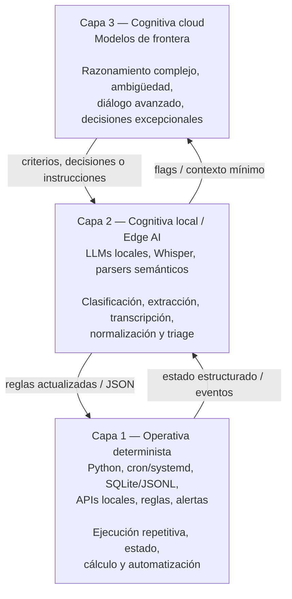

# iatokens
# Arquitectura tri-capa para agentes autónomos

**Separar código determinista, IA local e IA cloud para reducir tokens, latencia y exposición de datos**

> Documento de experiencia práctica. No pretende ser un paper académico ni un benchmark universal. Resume un patrón de arquitectura aplicado en agentes reales construidos sobre OpenClaw, con foco en producción, costos operativos y soberanía de datos.

---

## Resumen

Muchos agentes basados en LLMs terminan usando modelos de frontera en la nube para casi todo: leer datos crudos, repetir cálculos, revisar estados, decidir si hay novedades, formatear alertas y responder al usuario.

Ese enfoque funciona para prototipos, pero en producción tiene un problema claro: el costo, la latencia y el riesgo de privacidad crecen con la frecuencia de ejecución del agente, no con la dificultad real de la tarea.

Este documento propone una arquitectura tri-capa:

1. **Capa 1 — Operativa determinista:** código local para tareas repetitivas, numéricas, transaccionales y de alta frecuencia.
2. **Capa 2 — Cognitiva local / Edge AI:** modelos locales para clasificación, extracción, parsing, transcripción y triage semántico.
3. **Capa 3 — Cognitiva cloud:** modelos de frontera para razonamiento complejo, ambigüedad, diálogo avanzado y decisiones que realmente justifican el costo.

La idea central es simple:

> **No todo lo que parece “inteligente” necesita pasar por un LLM de frontera.**

En los agentes descritos acá, la mayor parte del trabajo continuo se resuelve localmente. La nube queda reservada para casos donde agrega valor real.

---

## 1. Problema: el agente FOMO

Llamo **agente FOMO** al patrón donde el agente manda todo al LLM “por las dudas”:

* logs completos,
* correos enteros,
* estados de cuenta,
* datos de mercado minuto a minuto,
* historiales repetidos,
* reglas que podrían estar codificadas,
* decisiones binarias simples,
* alertas que podrían formatearse con templates.

El resultado es un agente que parece sofisticado, pero que en la práctica tiene tres problemas:

### 1.1 Costo variable innecesario

Si cada evaluación rutinaria consume tokens, el costo mensual queda atado a la frecuencia de monitoreo.

Un scanner que corre cada minuto no debería pagarle a un LLM para descubrir que “no pasó nada”.

### 1.2 Latencia acumulada

Muchas tareas operativas requieren respuesta rápida: deduplicar, validar umbrales, consultar una API, guardar estado, enviar una alerta.

Para eso, un viaje completo a una API externa suele ser excesivo.

### 1.3 Exposición de datos

Enviar datos crudos a terceros puede ser aceptable en algunos contextos, pero no debería ser la opción por defecto.

Datos financieros, correos, credenciales, logs internos, conversaciones privadas o documentos corporativos deben pasar por un criterio de minimización antes de salir del entorno local.

---

## 2. Principio de diseño

La arquitectura se basa en una regla práctica:

> **Usar el nivel mínimo de inteligencia suficiente para resolver bien la tarea.**

No se trata de evitar la IA cloud. Se trata de usarla donde corresponde.

| Tipo de tarea                                                                                  | Mejor capa | Motivo                                         |
| ---------------------------------------------------------------------------------------------- | ---------: | ---------------------------------------------- |
| Cálculos, umbrales, deduplicación, consultas programadas, envío de alertas                     |     Capa 1 | Determinista, barato, auditable                |
| Clasificación de intención, extracción de entidades, resumen local, parsing semántico          |     Capa 2 | Requiere lenguaje, pero no necesariamente nube |
| Ambigüedad, negociación, razonamiento complejo, explicación al usuario, rediseño de estrategia |     Capa 3 | Requiere mayor capacidad cognitiva             |

---

## 3. Arquitectura propuesta



---

## 4. Capa 1: operativa determinista

La Capa 1 es el músculo del sistema.

Está compuesta por código tradicional: scripts, servicios, jobs, APIs, almacenamiento local y reglas explícitas.

En mis agentes, esta capa se encarga de:

* correr tareas programadas con `cron` o timers de `systemd`;
* consultar APIs estructuradas;
* calcular spreads, umbrales, z-scores, variaciones y señales;
* persistir estado en archivos `.json`, `.jsonl` o bases locales;
* deduplicar eventos mediante hashes;
* cachear sesiones o tokens cuando corresponde;
* disparar alertas por Telegram u otros canales;
* registrar logs auditables.

La Capa 1 no consume tokens.

Cuando una tarea puede expresarse como regla, cálculo, comparación, búsqueda estructurada o template, debería vivir acá.

### Ejemplo

Si un scanner financiero detecta que un arbitraje supera cierto umbral neto de comisiones, no hace falta pedirle a un LLM que “interprete” la oportunidad.

El código puede:

1. calcular el spread;
2. descontar comisiones;
3. validar liquidez mínima;
4. verificar duplicados;
5. enviar una alerta estructurada.

El LLM no aporta valor en ese loop.

---

## 5. # Arquitectura tri-capa para agentes autónomos

**Separar código determinista, IA local e IA cloud para reducir tokens, latencia y exposición de datos**

> Documento de experiencia práctica. No pretende ser un paper académico ni un benchmark universal. Resume un patrón de arquitectura aplicado en agentes reales construidos sobre OpenClaw, con foco en producción, costos operativos y soberanía de datos.

---

## Resumen

Muchos agentes basados en LLMs terminan usando modelos de frontera en la nube para casi todo: leer datos crudos, repetir cálculos, revisar estados, decidir si hay novedades, formatear alertas y responder al usuario.

Ese enfoque funciona para prototipos, pero en producción tiene un problema claro: el costo, la latencia y el riesgo de privacidad crecen con la frecuencia de ejecución del agente, no con la dificultad real de la tarea.

Este documento propone una arquitectura tri-capa:

1. **Capa 1 — Operativa determinista:** código local para tareas repetitivas, numéricas, transaccionales y de alta frecuencia.
2. **Capa 2 — Cognitiva local / Edge AI:** modelos locales para clasificación, extracción, parsing, transcripción y triage semántico.
3. **Capa 3 — Cognitiva cloud:** modelos de frontera para razonamiento complejo, ambigüedad, diálogo avanzado y decisiones que realmente justifican el costo.

La idea central es simple:

> **No todo lo que parece “inteligente” necesita pasar por un LLM de frontera.**

En los agentes descritos acá, la mayor parte del trabajo continuo se resuelve localmente. La nube queda reservada para casos donde agrega valor real.

---

## 1. Problema: el agente FOMO

Llamo **agente FOMO** al patrón donde el agente manda todo al LLM “por las dudas”:

* logs completos,
* correos enteros,
* estados de cuenta,
* datos de mercado minuto a minuto,
* historiales repetidos,
* reglas que podrían estar codificadas,
* decisiones binarias simples,
* alertas que podrían formatearse con templates.

El resultado es un agente que parece sofisticado, pero que en la práctica tiene tres problemas:

### 1.1 Costo variable innecesario

Si cada evaluación rutinaria consume tokens, el costo mensual queda atado a la frecuencia de monitoreo.

Un scanner que corre cada minuto no debería pagarle a un LLM para descubrir que “no pasó nada”.

### 1.2 Latencia acumulada

Muchas tareas operativas requieren respuesta rápida: deduplicar, validar umbrales, consultar una API, guardar estado, enviar una alerta.

Para eso, un viaje completo a una API externa suele ser excesivo.

### 1.3 Exposición de datos

Enviar datos crudos a terceros puede ser aceptable en algunos contextos, pero no debería ser la opción por defecto.

Datos financieros, correos, credenciales, logs internos, conversaciones privadas o documentos corporativos deben pasar por un criterio de minimización antes de salir del entorno local.

---

## 2. Principio de diseño

La arquitectura se basa en una regla práctica:

> **Usar el nivel mínimo de inteligencia suficiente para resolver bien la tarea.**

No se trata de evitar la IA cloud. Se trata de usarla donde corresponde.

| Tipo de tarea                                                                                  | Mejor capa | Motivo                                         |
| ---------------------------------------------------------------------------------------------- | ---------: | ---------------------------------------------- |
| Cálculos, umbrales, deduplicación, consultas programadas, envío de alertas                     |     Capa 1 | Determinista, barato, auditable                |
| Clasificación de intención, extracción de entidades, resumen local, parsing semántico          |     Capa 2 | Requiere lenguaje, pero no necesariamente nube |
| Ambigüedad, negociación, razonamiento complejo, explicación al usuario, rediseño de estrategia |     Capa 3 | Requiere mayor capacidad cognitiva             |

---

## 3. Arquitectura propuesta


---

## 4. Capa 1: operativa determinista

La Capa 1 es el músculo del sistema.

Está compuesta por código tradicional: scripts, servicios, jobs, APIs, almacenamiento local y reglas explícitas.

En mis agentes, esta capa se encarga de:

* correr tareas programadas con `cron` o timers de `systemd`;
* consultar APIs estructuradas;
* calcular spreads, umbrales, z-scores, variaciones y señales;
* persistir estado en archivos `.json`, `.jsonl` o bases locales;
* deduplicar eventos mediante hashes;
* cachear sesiones o tokens cuando corresponde;
* disparar alertas por Telegram u otros canales;
* registrar logs auditables.

La Capa 1 no consume tokens.

Cuando una tarea puede expresarse como regla, cálculo, comparación, búsqueda estructurada o template, debería vivir acá.

### Ejemplo

Si un scanner financiero detecta que un arbitraje supera cierto umbral neto de comisiones, no hace falta pedirle a un LLM que “interprete” la oportunidad.

El código puede:

1. calcular el spread;
2. descontar comisiones;
3. validar liquidez mínima;
4. verificar duplicados;
5. enviar una alerta estructurada.

El LLM no aporta valor en ese loop.

---

## 5. Capa 2: cognitiva local / Edge AI

La Capa 2 resuelve tareas donde el lenguaje importa, pero donde no siempre se justifica enviar datos a la nube.

Puede usar modelos locales ejecutados con herramientas como Ollama, llama.cpp u otros motores equivalentes. También puede incluir utilidades locales como Whisper para transcripción, FFmpeg para preprocesamiento multimedia o parsers propios.

En mis agentes, esta capa se usa para:

* clasificar intención del usuario;
* extraer entidades desde lenguaje natural;
* convertir texto libre en JSON;
* resumir información antes de escalarla;
* transcribir audios localmente;
* limpiar ruido antes de pasar contexto a modelos más caros;
* decidir si una situación merece escalarse a la Capa 3.

### Nota técnica sobre modelos locales

En el documento original mencionaba modelos de aproximadamente 30B parámetros cuantizados en 4-bit sobre una GPU de consumo con 16 GB de VRAM.

Para hacerlo técnicamente más preciso:

* un modelo de ~30B en 4-bit puede requerir más de 16 GB efectivos cuando se considera formato, KV cache, contexto y overhead del runtime;
* en una GPU de 16 GB, muchas configuraciones requieren offload parcial CPU/GPU, menor contexto, cuantizaciones más agresivas o modelos más chicos;
* aun así, para tareas de ruteo, extracción y triage, no siempre se necesita velocidad extrema ni un modelo de frontera.

Por eso, la afirmación correcta no es “un 30B entra completo en 16 GB”, sino:

> **Con cuantización y una configuración adecuada, un modelo local mediano puede ser suficiente como router semántico o filtro inteligente, incluso si parte de la inferencia se apoya en CPU/RAM.**

---

## 6. Capa 3: cognitiva cloud

La Capa 3 es la capa más cara y más capaz.

No está pensada para ejecutar loops rutinarios. Está pensada para intervenir cuando aparece una situación que requiere:

* razonamiento general complejo;
* explicación en lenguaje natural de alto nivel;
* resolución de ambigüedad;
* diálogo con usuarios o clientes;
* negociación;
* análisis estratégico;
* rediseño de reglas;
* auditoría semántica de una decisión;
* generación de documentos o comunicaciones importantes.

La Capa 3 no desaparece. Se vuelve más valiosa porque deja de estar ocupada haciendo trabajo de baja jerarquía.

---

## 7. Implementación en OpenClaw

Esta arquitectura fue aplicada en dos agentes autónomos construidos sobre OpenClaw:

* **JARVIS**, orientado a productividad, gestión personal y operación diaria.
* **Warren**, orientado a monitoreo financiero, señales y detección de oportunidades.

Los nombres son internos. Lo importante no son los nombres, sino el patrón de separación de responsabilidades.

---

## 8. Caso 1: JARVIS

JARVIS actúa como agente de productividad y coordinación operativa.

Su objetivo no es “pensar todo el tiempo”, sino reducir fricción en tareas cotidianas.

Ejemplos de responsabilidades:

* interpretar pedidos del usuario;
* revisar prioridades;
* estructurar información antes de enviarla a un modelo más potente;
* evitar reenviar contexto redundante;
* preparar datos en JSON;
* decidir si una tarea puede resolverse localmente o requiere escalamiento.

Un patrón útil es que JARVIS no alimenta a la Capa 3 con todo el flujo de correos, mensajes o eventos.

Primero filtra, resume, clasifica y compacta.

Esto reduce tokens y también mejora privacidad, porque la nube recibe menos datos y mejor seleccionados.

---

## 9. Caso 2: Warren

Warren es un agente de monitoreo financiero.

Su trabajo principal es correr scanners locales y detectar eventos accionables a partir de reglas, datos de mercado y cálculos.

Algunos ejemplos de tareas:

* monitoreo de arbitrajes entre instrumentos;
* comparación de plazos de liquidación;
* cálculo de oportunidades netas de comisiones;
* detección de spreads anómalos;
* señales técnicas simples;
* envío de alertas por Telegram.

La parte crítica es que Warren no usa un LLM para decidir cada minuto si existe o no una oportunidad.

Eso lo hace la Capa 1.

El LLM puede aparecer después, si el usuario pide:

* una explicación;
* una auditoría de por qué se disparó una señal;
* un resumen del día;
* una revisión de estrategia;
* una hipótesis sobre comportamiento de mercado.

### Importante

Warren no debe interpretarse como asesoramiento financiero automático.

Es un sistema de monitoreo y asistencia. Las decisiones finales, validaciones de riesgo y ejecución deben quedar bajo control humano y reglas explícitas.

---

## 10. Modelo simple de consumo de tokens

Para estimar el impacto, tomemos una jornada de mercado de 9 horas.

Supongamos los siguientes procesos:

| Proceso                              | Frecuencia | Ejecuciones diarias aproximadas |
| ------------------------------------ | ---------: | ------------------------------: |
| Scanner cross-arbitraje              | cada 1 min |                             540 |
| Scanner microestructura intradía     | cada 2 min |                             270 |
| Scanner arbitraje de plazos          | cada 5 min |                             108 |
| Scanners swing / señales adicionales |   variable |                             224 |
| **Total**                            |            |                       **1.142** |

> Nota: en el borrador original el scanner de 2 minutos estaba estimado en 240 ejecuciones para una jornada de 9 horas. Matemáticamente, 9 horas son 540 minutos, por lo que cada 2 minutos da aproximadamente 270 ejecuciones. Conviene ajustar este número o aclarar la ventana real usada.

### Escenario A: agente monolítico cloud

Si cada ejecución mandara contexto a un LLM cloud:

* tokens de entrada promedio por corrida: 2.000;
* tokens de salida promedio por corrida: 150;
* total por corrida: 2.150 tokens.

Entonces:

```text
1.142 ejecuciones/día × 2.150 tokens = 2.455.300 tokens/día
```

Para 22 días hábiles:

```text
2.455.300 × 22 = 54.016.600 tokens/mes
```

La mayoría de ese consumo se gastaría en confirmar que no ocurrió nada relevante.

### Escenario B: arquitectura tri-capa

En la arquitectura tri-capa:

* las evaluaciones rutinarias corren en Capa 1;
* los cálculos y alertas simples consumen 0 tokens externos;
* la Capa 2 se usa solo cuando hace falta lenguaje o triage semántico;
* la Capa 3 se activa bajo demanda o ante eventos excepcionales.

El costo deja de escalar linealmente con cada loop de monitoreo.

Esto no significa que el sistema sea gratis: hay costo de hardware, energía, mantenimiento y complejidad operativa.

Pero el costo variable por ejecución rutinaria puede bajar drásticamente.

---

## 11. Infraestructura local

Una topología razonable para este enfoque puede incluir:

* CPU con varios núcleos para jobs, servicios y procesamiento paralelo;
* RAM suficiente para cachear datos, contenedores y modelos parcialmente offloaded;
* GPU de consumo o profesional según el tamaño del modelo local;
* almacenamiento local rápido;
* Docker o similar para aislar servicios;
* logs persistentes y trazabilidad.

En mi caso, el entorno local incluye hardware de escritorio potente y servicios corriendo en contenedores. La Capa 1 se beneficia más de estabilidad, observabilidad y buen diseño de estado que de “más IA”.

La Capa 2 se beneficia de modelos cuantizados, pero no necesita resolver todo. Su función principal es actuar como filtro inteligente.

---

## 12. Reglas de ruteo

Una implementación práctica necesita reglas claras para decidir cuándo escalar.

Ejemplo de política:

```text
1. Si la tarea es numérica, transaccional o repetitiva:
   resolver en Capa 1.

2. Si la tarea requiere entender lenguaje pero no implica alto riesgo:
   resolver en Capa 2.

3. Si la Capa 2 devuelve baja confianza, ambigüedad o conflicto:
   escalar a Capa 3.

4. Si hay datos sensibles:
   minimizar, resumir o anonimizar antes de escalar.

5. Si la decisión tiene impacto financiero, legal, reputacional o de seguridad:
   requerir validación humana o reglas explícitas.
```

---

## 13. Métricas recomendadas

Para saber si la arquitectura funciona, conviene medir:

* cantidad de ejecuciones de Capa 1;
* cantidad de llamadas a Capa 2;
* cantidad de llamadas a Capa 3;
* tokens externos consumidos por día;
* tokens externos evitados;
* latencia por tipo de tarea;
* falsos positivos y falsos negativos;
* eventos escalados;
* eventos resueltos localmente;
* costo mensual estimado;
* incidentes de privacidad evitados por minimización de datos.

Sin métricas, es fácil confundir “agente inteligente” con “agente que llama mucho a un LLM”.

---

## 14. Lecciones aprendidas

### 14.1 El estado importa más que el prompt

Muchos problemas de agentes no se resuelven con prompts más largos, sino con mejor manejo de estado.

Un archivo de estado bien diseñado, una base local, deduplicación y logs claros reducen más tokens que cualquier optimización cosmética del prompt.

### 14.2 Los LLMs son malos reemplazos de reglas simples

Un LLM puede explicar una regla, pero no debería ser necesario para ejecutarla cada minuto.

Si la decisión puede expresarse como código, el código suele ser más barato, rápido y auditable.

### 14.3 La IA local no tiene que ser perfecta

La Capa 2 no necesita competir con un modelo de frontera.

Necesita ser suficientemente buena para filtrar, estructurar y decidir cuándo escalar.

### 14.4 La nube debe recibir contexto, no ruido

Cuando la Capa 3 recibe menos información pero mejor preparada, suele responder mejor.

El objetivo no es ocultarle información útil al modelo, sino evitar enviarle datos repetidos, sensibles o irrelevantes.

---

## 15. Limitaciones

Esta arquitectura no elimina todos los problemas.

Algunas limitaciones reales:

* requiere más ingeniería inicial que un agente cloud monolítico;
* obliga a diseñar bien estado, logs y reglas;
* los modelos locales pueden ser lentos o insuficientes para tareas complejas;
* el hardware local tiene costo y mantenimiento;
* una mala política de ruteo puede escalar poco o demasiado;
* los sistemas financieros o sensibles requieren controles humanos y auditoría adicional.

Este patrón no es una solución universal. Es una estrategia útil cuando hay loops frecuentes, datos sensibles, costos crecientes o necesidad de control local.

---

## 16. Trabajo futuro

Líneas de mejora:

* router semántico con umbrales de confianza medibles;
* evaluación automática de cuándo conviene escalar;
* presupuestos diarios o mensuales de tokens;
* trazabilidad completa de decisiones entre capas;
* benchmarks internos por tipo de tarea;
* aprendizaje a partir de correcciones humanas;
* dashboards de costo, latencia y privacidad;
* tests de regresión para reglas deterministas.

---

## 17. Conclusión

La principal conclusión de esta experiencia es que los agentes autónomos en producción no deberían construirse como una llamada permanente a un LLM de frontera.

Un agente robusto necesita separar responsabilidades:

* código determinista para lo repetitivo;
* IA local para entender y estructurar;
* IA cloud para razonar cuando realmente hace falta.

La arquitectura tri-capa no busca reemplazar los modelos de frontera. Busca usarlos mejor.

Cuando la nube deja de hacer trabajo rutinario, se vuelve más barata, más segura y más útil.


## 6. Capa 3: cognitiva cloud

La Capa 3 es la capa más cara y más capaz.

No está pensada para ejecutar loops rutinarios. Está pensada para intervenir cuando aparece una situación que requiere:

* razonamiento general complejo;
* explicación en lenguaje natural de alto nivel;
* resolución de ambigüedad;
* diálogo con usuarios o clientes;
* negociación;
* análisis estratégico;
* rediseño de reglas;
* auditoría semántica de una decisión;
* generación de documentos o comunicaciones importantes.

La Capa 3 no desaparece. Se vuelve más valiosa porque deja de estar ocupada haciendo trabajo de baja jerarquía.

---

## 7. Implementación en OpenClaw

Esta arquitectura fue aplicada en dos agentes autónomos construidos sobre OpenClaw:

* **JARVIS**, orientado a productividad, gestión personal y operación diaria.
* **Warren**, orientado a monitoreo financiero, señales y detección de oportunidades.

Los nombres son internos. Lo importante no son los nombres, sino el patrón de separación de responsabilidades.

---

## 8. Caso 1: JARVIS

JARVIS actúa como agente de productividad y coordinación operativa.

Su objetivo no es “pensar todo el tiempo”, sino reducir fricción en tareas cotidianas.

Ejemplos de responsabilidades:

* interpretar pedidos del usuario;
* revisar prioridades;
* estructurar información antes de enviarla a un modelo más potente;
* evitar reenviar contexto redundante;
* preparar datos en JSON;
* decidir si una tarea puede resolverse localmente o requiere escalamiento.

Un patrón útil es que JARVIS no alimenta a la Capa 3 con todo el flujo de correos, mensajes o eventos.

Primero filtra, resume, clasifica y compacta.

Esto reduce tokens y también mejora privacidad, porque la nube recibe menos datos y mejor seleccionados.

---

## 9. Caso 2: Warren

Warren es un agente de monitoreo financiero.

Su trabajo principal es correr scanners locales y detectar eventos accionables a partir de reglas, datos de mercado y cálculos.

Algunos ejemplos de tareas:

* monitoreo de arbitrajes entre instrumentos;
* comparación de plazos de liquidación;
* cálculo de oportunidades netas de comisiones;
* detección de spreads anómalos;
* señales técnicas simples;
* envío de alertas por Telegram.

La parte crítica es que Warren no usa un LLM para decidir cada minuto si existe o no una oportunidad.

Eso lo hace la Capa 1.

El LLM puede aparecer después, si el usuario pide:

* una explicación;
* una auditoría de por qué se disparó una señal;
* un resumen del día;
* una revisión de estrategia;
* una hipótesis sobre comportamiento de mercado.

### Importante

Warren no debe interpretarse como asesoramiento financiero automático.

Es un sistema de monitoreo y asistencia. Las decisiones finales, validaciones de riesgo y ejecución deben quedar bajo control humano y reglas explícitas.

---

## 10. Modelo simple de consumo de tokens

Para estimar el impacto, tomemos una jornada de mercado de 9 horas.

Supongamos los siguientes procesos:

| Proceso                              | Frecuencia | Ejecuciones diarias aproximadas |
| ------------------------------------ | ---------: | ------------------------------: |
| Scanner cross-arbitraje              | cada 1 min |                             540 |
| Scanner microestructura intradía     | cada 2 min |                             270 |
| Scanner arbitraje de plazos          | cada 5 min |                             108 |
| Scanners swing / señales adicionales |   variable |                             224 |
| **Total**                            |            |                       **1.142** |

> Nota: en el borrador original el scanner de 2 minutos estaba estimado en 240 ejecuciones para una jornada de 9 horas. Matemáticamente, 9 horas son 540 minutos, por lo que cada 2 minutos da aproximadamente 270 ejecuciones. Conviene ajustar este número o aclarar la ventana real usada.

### Escenario A: agente monolítico cloud

Si cada ejecución mandara contexto a un LLM cloud:

* tokens de entrada promedio por corrida: 2.000;
* tokens de salida promedio por corrida: 150;
* total por corrida: 2.150 tokens.

Entonces:

```text
1.142 ejecuciones/día × 2.150 tokens = 2.455.300 tokens/día
```

Para 22 días hábiles:

```text
2.455.300 × 22 = 54.016.600 tokens/mes
```

La mayoría de ese consumo se gastaría en confirmar que no ocurrió nada relevante.

### Escenario B: arquitectura tri-capa

En la arquitectura tri-capa:

* las evaluaciones rutinarias corren en Capa 1;
* los cálculos y alertas simples consumen 0 tokens externos;
* la Capa 2 se usa solo cuando hace falta lenguaje o triage semántico;
* la Capa 3 se activa bajo demanda o ante eventos excepcionales.

El costo deja de escalar linealmente con cada loop de monitoreo.

Esto no significa que el sistema sea gratis: hay costo de hardware, energía, mantenimiento y complejidad operativa.

Pero el costo variable por ejecución rutinaria puede bajar drásticamente.

---

## 11. Infraestructura local

Una topología razonable para este enfoque puede incluir:

* CPU con varios núcleos para jobs, servicios y procesamiento paralelo;
* RAM suficiente para cachear datos, contenedores y modelos parcialmente offloaded;
* GPU de consumo o profesional según el tamaño del modelo local;
* almacenamiento local rápido;
* Docker o similar para aislar servicios;
* logs persistentes y trazabilidad.

En mi caso, el entorno local incluye hardware de escritorio potente y servicios corriendo en contenedores. La Capa 1 se beneficia más de estabilidad, observabilidad y buen diseño de estado que de “más IA”.

La Capa 2 se beneficia de modelos cuantizados, pero no necesita resolver todo. Su función principal es actuar como filtro inteligente.

---

## 12. Reglas de ruteo

Una implementación práctica necesita reglas claras para decidir cuándo escalar.

Ejemplo de política:

```text
1. Si la tarea es numérica, transaccional o repetitiva:
   resolver en Capa 1.

2. Si la tarea requiere entender lenguaje pero no implica alto riesgo:
   resolver en Capa 2.

3. Si la Capa 2 devuelve baja confianza, ambigüedad o conflicto:
   escalar a Capa 3.

4. Si hay datos sensibles:
   minimizar, resumir o anonimizar antes de escalar.

5. Si la decisión tiene impacto financiero, legal, reputacional o de seguridad:
   requerir validación humana o reglas explícitas.
```

---

## 13. Métricas recomendadas

Para saber si la arquitectura funciona, conviene medir:

* cantidad de ejecuciones de Capa 1;
* cantidad de llamadas a Capa 2;
* cantidad de llamadas a Capa 3;
* tokens externos consumidos por día;
* tokens externos evitados;
* latencia por tipo de tarea;
* falsos positivos y falsos negativos;
* eventos escalados;
* eventos resueltos localmente;
* costo mensual estimado;
* incidentes de privacidad evitados por minimización de datos.

Sin métricas, es fácil confundir “agente inteligente” con “agente que llama mucho a un LLM”.

---

## 14. Lecciones aprendidas

### 14.1 El estado importa más que el prompt

Muchos problemas de agentes no se resuelven con prompts más largos, sino con mejor manejo de estado.

Un archivo de estado bien diseñado, una base local, deduplicación y logs claros reducen más tokens que cualquier optimización cosmética del prompt.

### 14.2 Los LLMs son malos reemplazos de reglas simples

Un LLM puede explicar una regla, pero no debería ser necesario para ejecutarla cada minuto.

Si la decisión puede expresarse como código, el código suele ser más barato, rápido y auditable.

### 14.3 La IA local no tiene que ser perfecta

La Capa 2 no necesita competir con un modelo de frontera.

Necesita ser suficientemente buena para filtrar, estructurar y decidir cuándo escalar.

### 14.4 La nube debe recibir contexto, no ruido

Cuando la Capa 3 recibe menos información pero mejor preparada, suele responder mejor.

El objetivo no es ocultarle información útil al modelo, sino evitar enviarle datos repetidos, sensibles o irrelevantes.

---

## 15. Limitaciones

Esta arquitectura no elimina todos los problemas.

Algunas limitaciones reales:

* requiere más ingeniería inicial que un agente cloud monolítico;
* obliga a diseñar bien estado, logs y reglas;
* los modelos locales pueden ser lentos o insuficientes para tareas complejas;
* el hardware local tiene costo y mantenimiento;
* una mala política de ruteo puede escalar poco o demasiado;
* los sistemas financieros o sensibles requieren controles humanos y auditoría adicional.

Este patrón no es una solución universal. Es una estrategia útil cuando hay loops frecuentes, datos sensibles, costos crecientes o necesidad de control local.

---

## 16. Trabajo futuro

Líneas de mejora:

* router semántico con umbrales de confianza medibles;
* evaluación automática de cuándo conviene escalar;
* presupuestos diarios o mensuales de tokens;
* trazabilidad completa de decisiones entre capas;
* benchmarks internos por tipo de tarea;
* aprendizaje a partir de correcciones humanas;
* dashboards de costo, latencia y privacidad;
* tests de regresión para reglas deterministas.

---

## 17. Conclusión

La principal conclusión de esta experiencia es que los agentes autónomos en producción no deberían construirse como una llamada permanente a un LLM de frontera.

Un agente robusto necesita separar responsabilidades:

* código determinista para lo repetitivo;
* IA local para entender y estructurar;
* IA cloud para razonar cuando realmente hace falta.

La arquitectura tri-capa no busca reemplazar los modelos de frontera. Busca usarlos mejor.

Cuando la nube deja de hacer trabajo rutinario, se vuelve más barata, más segura y más útil.
